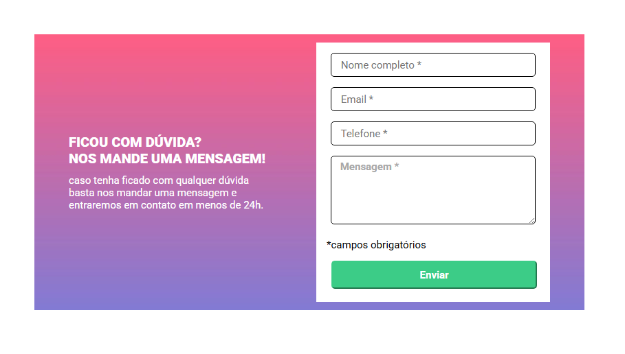
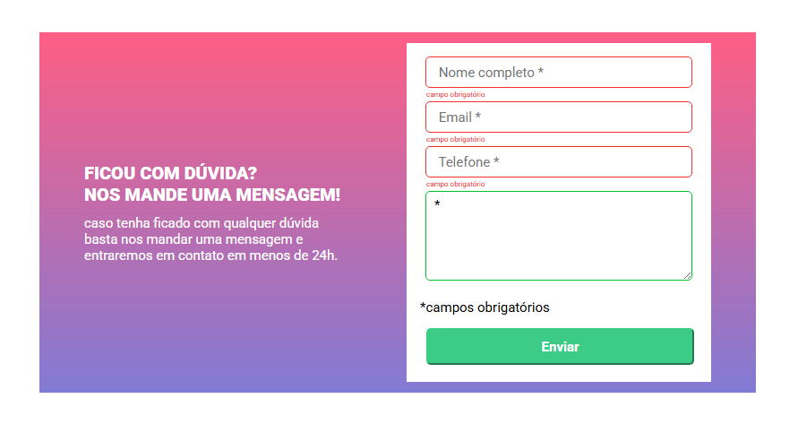

# Formulário com validação de input

<b>Esta é uma solução para o desafio do módulo de JavaScrip intermediário, proposto do curso DevQuest.</b>

## Visão Geral 

###  Projeto 
<b>O objetivo é criar uma página de formulário com validação de input, desenvolvendo habilidades de HTML, CSS e JavaScript.

###  Desafio

<b>O desafio consiste em construir uma página de formulário a partir dos designs e funcionalidades fornecidas. E ao clicar no botão para enviar, é feita a validação do preenchimento do input alterando a cor da borda.

### Funcionalidades 
<ul>
<li>Ao clicar no botão para enviar o formulário, é feita a validação dos inpúts e a cor da borda altera dependendo do preenchimento. Se o input estiver preenchedo, a borda muda para a cor verde e  se caso algum dos inputs estiver vazio, altera para a cor vermelha e uma mensagem de "campo obrigatório" aparece embaixo do input.
</ul>

### Capturas de tela 

Preview:  
  
Preview com validação:  

 

### Links 
<ul>
<li><a href="https://github.com/fernanda-nunes/formulario-com-validacao-de-imput/" target="_blank">Repositórios</a></li>
<li><a href="https://fernanda-nunes.github.io/formulario-com-validacao-de-input/" target="_blank">Site ao vivo</a></li>
</ul>

## O que eu aprendi 

<b> Durante o desenvolvimento deste projeto, tive a oportunidade de consolidar e expandir minhas habilidades em desenvolvimento front-end. 
